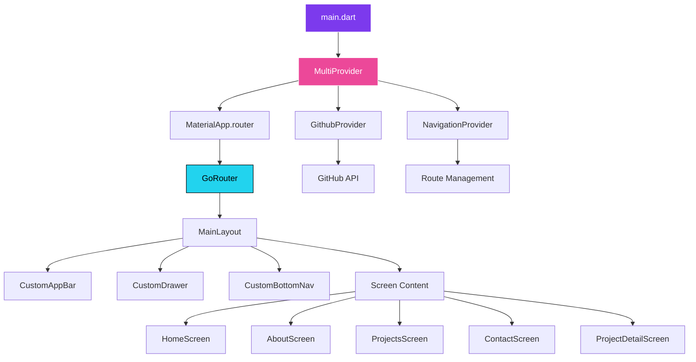
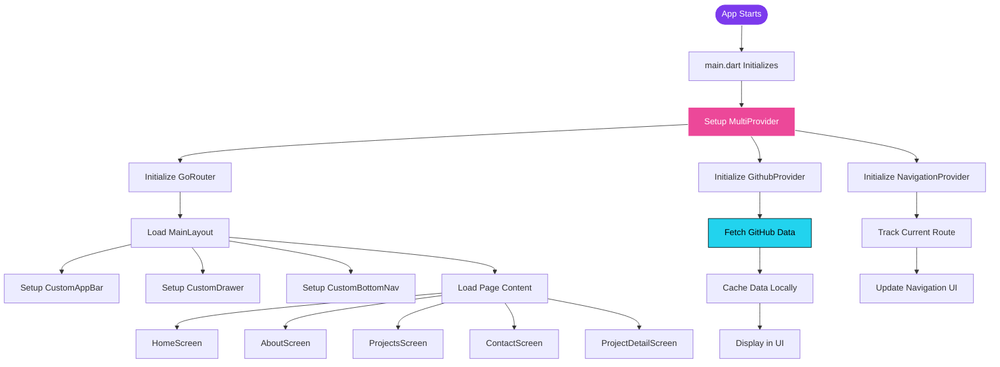
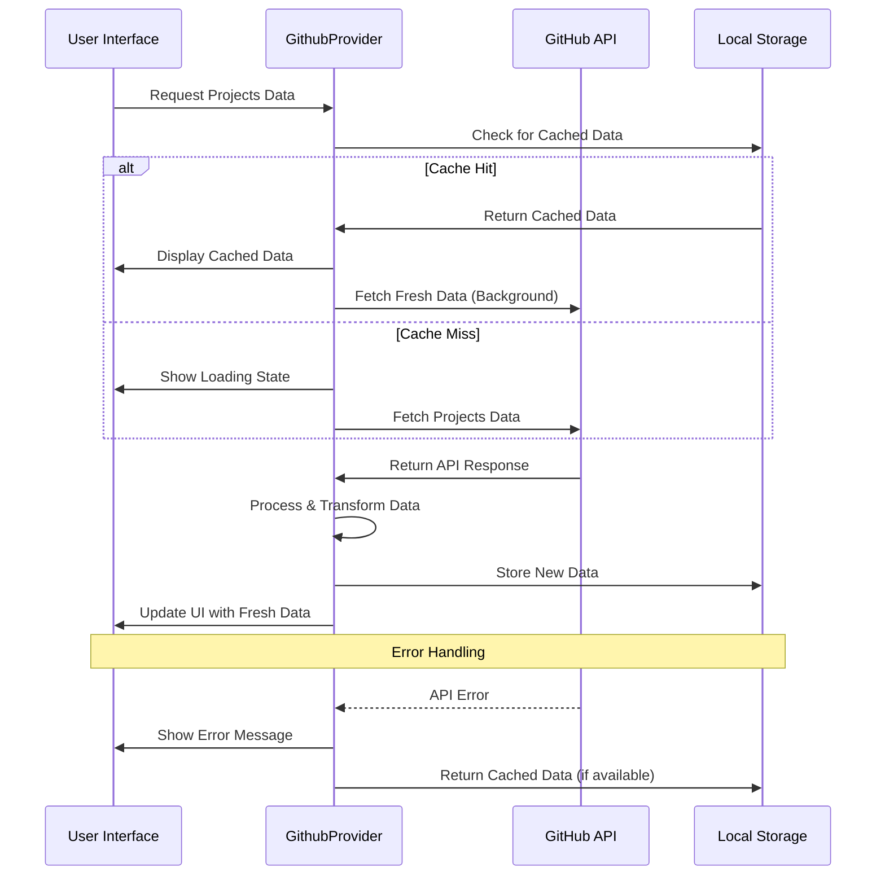
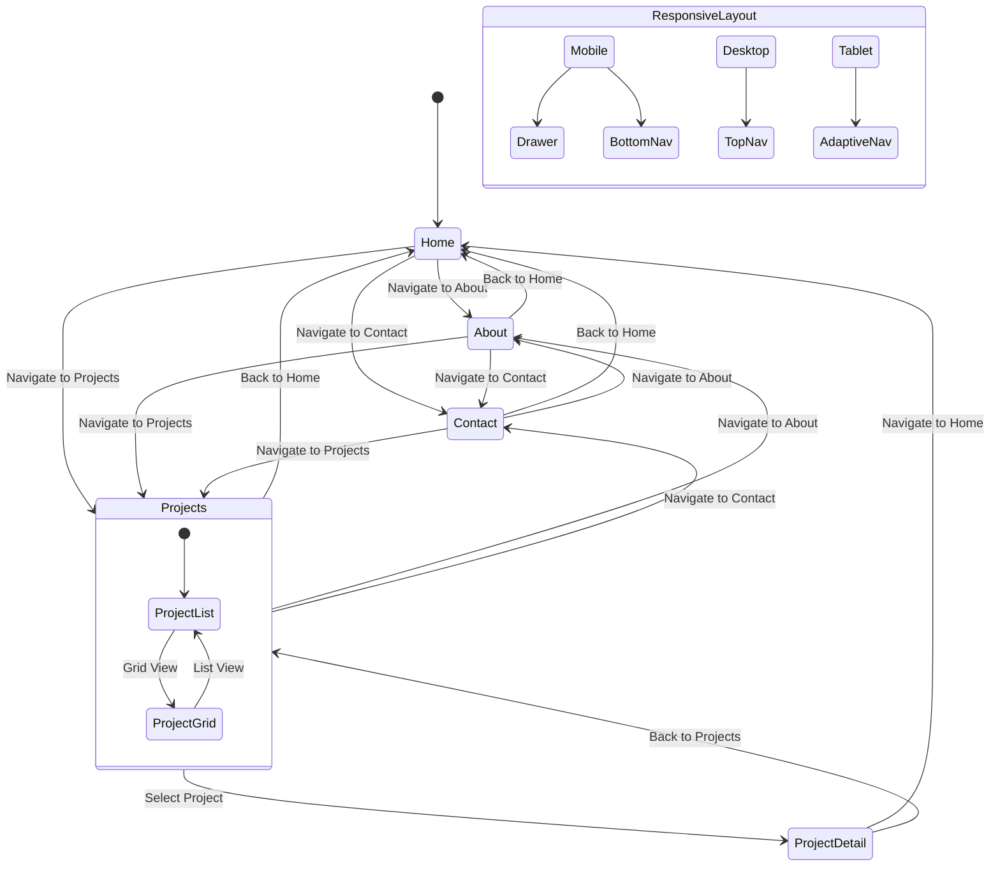
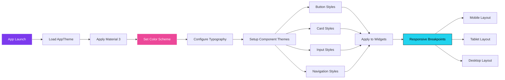

# 🎯 Nitish Portfolio - Flutter Application

A comprehensive, modern portfolio application built with Flutter that showcases professional projects, skills, and experience. This cross-platform app features a sleek dark theme, smooth animations, and responsive design optimized for all devices.

## 📑 Table of Contents

- [✨ Features](#-features)
- [🏗️ Project Architecture](#-project-architecture)
- [📁 Project Structure](#-project-structure)
- [🔧 Core Modules](#-core-modules)
- [📱 Screens & Components](#-screens--components)
- [📊 Data Flow & Workflow](#-data-flow--workflow)
- [🚀 Quick Start](#-quick-start)
- [📦 Dependencies](#-dependencies)
- [🎨 Design System](#-design-system)
- [📈 Performance Features](#-performance-features)
- [🔄 Development Workflow](#-development-workflow)

## ✨ Features

### 🎯 Core Features
- **Cross-Platform**: Android, iOS, Web, Windows, macOS, Linux support
- **Responsive Design**: Adaptive layouts for mobile, tablet, and desktop
- **Modern UI**: Dark theme with neon accents and glassmorphism effects
- **Smooth Animations**: Flutter Animate for engaging user interactions
- **GitHub Integration**: Live project data fetched from GitHub API
- **Navigation**: GoRouter for seamless page transitions and deep linking
- **State Management**: Provider pattern for efficient data handling
- **Performance Optimized**: Cached network images and lazy loading

### 🛠️ Technical Features
- **Material 3 Design**: Latest Material Design guidelines
- **Type Safety**: Full null safety implementation
- **Code Quality**: Comprehensive error handling and validation
- **Modular Architecture**: Clean separation of concerns
- **Internationalization Ready**: Structure supports multiple languages
- **Accessibility**: Screen reader support and semantic labels

## 🏗️ Project Architecture



## 📁 Project Structure

```
flutter_portfolio/
├── 📁 lib/
│   ├── 📁 core/                    # Core application modules
│   │   ├── 📁 router/              # Navigation & routing
│   │   │   └── app_router.dart     # GoRouter configuration
│   │   └── 📁 theme/               # Design system & theming
│   │       └── app_theme.dart      # App-wide theme configuration
│   │
│   ├── 📁 models/                  # Data models & entities
│   │   ├── github_user.dart        # GitHub user data model
│   │   ├── project.dart            # GitHub project model
│   │   └── portfolio_project.dart  # Portfolio project model
│   │
│   ├── 📁 providers/               # State management
│   │   ├── github_provider.dart    # GitHub API state management
│   │   └── navigation_provider.dart # Navigation state management
│   │
│   ├── 📁 screens/                 # Page screens
│   │   ├── home_screen.dart        # Landing page with hero section
│   │   ├── about_screen.dart       # About me page
│   │   ├── projects_screen.dart    # Projects gallery
│   │   ├── project_detail_screen.dart # Individual project details
│   │   └── contact_screen.dart     # Contact form & information
│   │
│   ├── 📁 widgets/                 # Reusable UI components
│   │   ├── 📁 common/              # Shared components
│   │   │   ├── custom_app_bar.dart      # Adaptive app bar
│   │   │   ├── custom_bottom_nav.dart   # Mobile bottom navigation
│   │   │   ├── custom_drawer.dart       # Mobile drawer menu
│   │   │   └── main_layout.dart         # Main app layout wrapper
│   │   │
│   │   └── 📁 home/                # Home screen widgets
│   │       ├── hero_section.dart        # Hero banner with introduction
│   │       ├── about_section.dart       # About summary section
│   │       ├── skills_section.dart      # Skills with progress bars
│   │       ├── experience_section.dart  # Work experience timeline
│   │       ├── work_section.dart        # Work approach highlights
│   │       ├── projects_section.dart    # Featured projects grid
│   │       ├── testimonials_section.dart # Client testimonials
│   │       └── testimonials_section_with_provider.dart # Enhanced testimonials with state management
│   │
│   └── main.dart                   # Application entry point
│
├── 📁 web/                         # Web-specific files
│   ├── index.html                  # Web app entry point
│   └── manifest.json               # PWA manifest
│
├── 📁 assets/                      # Static assets
│   ├── 📁 images/                  # Image assets
│   ├── 📁 icons/                   # Icon assets
│   └── 📁 animations/              # Animation files
│
├── 📁 android/                     # Android-specific configuration
├── 📁 ios/                         # iOS-specific configuration
├── 📁 windows/                     # Windows-specific configuration
├── 📁 macos/                       # macOS-specific configuration
├── 📁 linux/                       # Linux-specific configuration
│
├── pubspec.yaml                    # Dependencies & metadata
├── pubspec.lock                    # Dependency lock file
└── README.md                       # Project documentation
```

## 🔧 Core Modules

### 🧭 Navigation Module (`core/router/`)
**Purpose**: Handles all application routing and navigation logic

- **app_router.dart**: GoRouter configuration with route definitions
  - **Routes**: `/`, `/about`, `/projects`, `/projects/:id`, `/contact`
  - **Features**: Deep linking, route guards, nested navigation
  - **Shell Route**: Wraps pages with consistent layout

### 🎨 Theme Module (`core/theme/`)
**Purpose**: Centralized design system and theming

- **app_theme.dart**: Complete theme configuration
  - **Color Palette**: Dark theme with neon accents
  - **Typography**: Google Fonts (Inter) with consistent sizing
  - **Material 3**: Updated to latest Material Design specs
  - **Custom Styles**: Cards, buttons, input fields, shadows

### 📊 Data Models (`models/`)
**Purpose**: Data structure definitions and business logic

- **github_user.dart**: GitHub user profile data structure
- **project.dart**: Comprehensive GitHub project model with metadata
- **portfolio_project.dart**: Simplified project model for portfolio display
- **testimonial.dart**: Client testimonials data model with rating and feedback structure

### 🔄 State Management (`providers/`)
**Purpose**: Application state management using Provider pattern

- **github_provider.dart**:
  - GitHub API integration
  - Project data fetching and caching
  - Error handling and retry logic
  - Loading states management

- **navigation_provider.dart**:
  - Current route tracking
  - Navigation history
  - Menu state management
  - Responsive navigation logic

- **testimonials_provider.dart**:
  - Testimonials data management
  - Client feedback state handling
  - Dynamic testimonials loading
  - Integration with testimonials service

### 🛠️ Services Module (`core/services/`)
**Purpose**: Business logic and external service integrations

- **testimonials_service.dart**:
  - Testimonials data fetching
  - Client reviews management
  - Service layer abstraction
  - Mock data provision for development

## 📱 Screens & Components

### 🏠 HomeScreen (`screens/home_screen.dart`)
**Purpose**: Main landing page with comprehensive overview

**Components Used**:
- `HeroSection`: Introduction and call-to-action
- `WorkSection`: Work approach and methodology
- `ProjectsSection`: Featured projects preview
- `TestimonialsSection`: Client feedback

**Features**:
- Animated section loading
- Scroll-based animations
- Responsive grid layouts
- GitHub data integration

### 👤 AboutScreen (`screens/about_screen.dart`)
**Purpose**: Detailed personal and professional information

**Features**:
- Skills showcase with chips
- Professional summary
- Interactive elements
- Responsive card layout

### 💼 ProjectsScreen (`screens/projects_screen.dart`)
**Purpose**: Complete projects gallery

**Features**:
- Grid layout with project cards
- Technology tag filtering
- Project preview images
- Navigation to detail pages

### 🔍 ProjectDetailScreen (`screens/project_detail_screen.dart`)
**Purpose**: Individual project showcase

**Features**:
- Detailed project information
- Technology stack display
- External links (GitHub, Live Demo)
- Responsive image gallery

### 📞 ContactScreen (`screens/contact_screen.dart`)
**Purpose**: Contact form and information

**Features**:
- Validated contact form
- Success/error messaging
- Contact information display
- Form submission handling
- Development debugging tools

## 📊 Data Flow & Workflow

### 🔄 Application Initialization Workflow



### 🌐 GitHub Integration Workflow



### 📱 Navigation Workflow



### 🎨 Theme & UI Workflow



## 🚀 Quick Start

### 📋 Prerequisites

- **Flutter SDK**: 3.32.0 or higher
- **Dart SDK**: 3.0.0 or higher
- **IDE**: Android Studio / VS Code with Flutter extensions
- **Git**: Version control
- **Platform SDKs**: Android SDK, Xcode (for iOS), etc.

### ⚡ Installation

```bash
# 1. Clone the repository
git clone <repository-url>
cd flutter_portfolio

# 2. Install dependencies
flutter pub get

# 3. Run flutter doctor to check setup
flutter doctor

# 4. Accept Android licenses (if needed)
flutter doctor --android-licenses

# 5. Run the application
flutter run

# For web development
flutter run -d chrome

# For specific device
flutter devices
flutter run -d <device-id>
```

### 🏗️ Building for Production

```bash
# Android APK
flutter build apk --release --target-platform=android-arm64

# Android App Bundle (Recommended for Play Store)
flutter build appbundle --release

# iOS (requires macOS and Xcode)
flutter build ios --release

# Web (Progressive Web App)
flutter build web --release --web-renderer html

# Desktop Applications
flutter build windows --release
flutter build macos --release
flutter build linux --release
```

## 📦 Dependencies

### 🎯 Core Dependencies

```yaml
# Framework
flutter: sdk
flutter_web_plugins: sdk

# Navigation
go_router: ^12.1.3        # Declarative routing

# State Management  
provider: ^6.1.5          # Provider pattern for state

# UI & Styling
google_fonts: ^6.3.0      # Typography
flutter_animate: ^4.5.2   # Smooth animations
lottie: ^2.7.0            # Vector animations
shimmer: ^3.0.0           # Loading effects
```

### 🌐 Network & Data

```yaml
# HTTP Clients
dio: ^5.9.0               # Advanced HTTP client
http: ^1.5.0              # Basic HTTP requests

# Image Handling
cached_network_image: ^3.4.1  # Image caching
flutter_svg: ^2.2.0          # SVG support

# Local Storage
shared_preferences: ^2.5.3   # Key-value storage
```

### 🛠️ Utilities & Tools

```yaml
# External Integrations
url_launcher: ^6.3.2         # External URLs

# UI Enhancements
flutter_staggered_grid_view: ^0.7.0  # Advanced grids

# Development
flutter_lints: ^3.0.2        # Code quality
```

## 🎨 Design System

### 🎨 Color Palette

```dart
// Primary Colors
Primary Purple:   #7C3AED  // Main brand color
Primary Light:    #8B5CF6  // Hover states
Primary Dark:     #6D28D9  // Active states

// Secondary Colors
Secondary Pink:   #EC4899  // Accent elements
Secondary Light:  #F472B6  // Highlights
Secondary Dark:   #DB2777  // Emphasis

// Accent Colors
Accent Cyan:      #22D3EE  // Call-to-action
Accent Light:     #67E8F9  // Interactive elements
Accent Dark:      #06B6D4  // Pressed states

// Neutral Colors
Background:       #0F0F17  // Main background
Surface:          #1E1E2E  // Card backgrounds
Surface Elevated: #28283B  // Raised elements
Border:           #334155  // Dividers & outlines

// Text Colors
Text Primary:     #FFFFFF  // Main text
Text Secondary:   #CBD5E1  // Supporting text
Text Muted:       #94A3B8  // Subtle text
```

### 📝 Typography Scale

```dart
// Display Text (Hero sections)
Display Large:    56px, Weight 800, -0.02 letter spacing
Display Medium:   45px, Weight 700, -0.02 letter spacing
Display Small:    36px, Weight 700, -0.01 letter spacing

// Headlines (Section titles)
Headline Large:   32px, Weight 700, -0.01 letter spacing
Headline Medium:  28px, Weight 600, -0.01 letter spacing
Headline Small:   24px, Weight 600, normal letter spacing

// Body Text (Content)
Body Large:       18px, Weight 400, 1.7 line height
Body Medium:      16px, Weight 400, 1.6 line height
Body Small:       14px, Weight 400, 1.5 line height

// Labels (Buttons, chips)
Label Large:      14px, Weight 500, 0.05 letter spacing
```

### 🧩 Component Specifications

#### 📱 Cards
```dart
Border Radius:    16px
Elevation:        4dp
Shadow Color:     Black 30% opacity
Border:           Border color 20% opacity
Padding:          16px internal
Margin:           16px between cards
```

#### 🔘 Buttons
```dart
Primary Button:   
  - Background: Primary Purple
  - Text: White
  - Border Radius: 16px
  - Padding: 16px vertical, 32px horizontal
  - Elevation: 4dp

Secondary Button:
  - Background: Transparent
  - Border: Primary Purple 2px
  - Text: Primary Purple
  - Hover: Primary Purple 10% background
```

#### 📝 Input Fields
```dart
Border Radius:    16px
Fill Color:       Surface color
Border Color:     Border color 30% opacity
Focus Color:      Primary Purple 2px
Label Color:      Text Muted
Padding:          16px internal
```

## 📈 Performance Features

### ⚡ Optimization Strategies

1. **Lazy Loading**
   - Images loaded on-demand
   - Sections loaded as user scrolls
   - Project data fetched progressively

2. **Caching System**
   - Network images cached automatically
   - API responses cached locally
   - Smart cache invalidation

3. **Memory Management**
   - Efficient widget disposal
   - Image memory cleanup
   - Provider state cleanup

4. **Bundle Optimization**
   - Tree shaking for unused code
   - Asset compression
   - Font subsetting

### 📊 Performance Metrics

```dart
// Target Performance Goals
App Launch Time:     < 2 seconds
Page Transitions:    < 300ms
Image Load Time:     < 1 second
API Response:        < 2 seconds
Memory Usage:        < 100MB
Bundle Size:         < 10MB (web)
```

## 🔄 Development Workflow

### 🔄 Git Workflow

```bash
# Feature Development
git checkout -b feature/new-feature
git add .
git commit -m "feat: add new feature"
git push origin feature/new-feature

# Create Pull Request
# Code Review
# Merge to main

# Release Process
git checkout main
git pull origin main
git tag v1.0.1
git push origin --tags
```

### 🧪 Testing Strategy

```bash
# Unit Tests
flutter test test/

# Widget Tests
flutter test test/widgets/

# Integration Tests
flutter drive --target=test_driver/app.dart

# Code Coverage
flutter test --coverage
genhtml coverage/lcov.info -o coverage/html
```

### 📋 Code Quality Checklist

- [ ] **Null Safety**: All code uses null safety
- [ ] **Linting**: No lint warnings or errors
- [ ] **Performance**: 60fps on target devices
- [ ] **Accessibility**: Screen reader compatible
- [ ] **Responsive**: Works on all screen sizes
- [ ] **Testing**: Unit and widget tests pass
- [ ] **Documentation**: Code is well documented

## 🔧 Configuration & Customization

### 🔑 GitHub Configuration

```dart
// lib/core/config/github_config.dart
class GitHubConfig {
  /// Your GitHub username
  static const String username = 'your-github-username';
  
  /// Optional: GitHub Personal Access Token
  /// Increases rate limit from 60 to 5000 requests/hour
  /// Generate at: https://github.com/settings/tokens
  static const String? token = null; // Add your token here
  
  /// Other configurable options
  static const String baseUrl = 'https://api.github.com';
  static const String userAgent = 'Flutter-Portfolio-App/1.0';
  static const int cacheMinutes = 2;
}
```

**Setting up GitHub Token (Recommended):**
1. Go to [GitHub Token Settings](https://github.com/settings/tokens)
2. Click "Generate new token (classic)"
3. Give it a name like "Portfolio App"
4. Select scopes: `public_repo` and `read:user`
5. Copy the token and update the config file

### 🎨 Theme Customization

```dart
// Customize colors in lib/core/theme/app_theme.dart
static const Color primary = Color(0xFF7C3AED); // Change primary color
static const Color secondary = Color(0xFFEC4899); // Change secondary color

// Customize fonts
textTheme: GoogleFonts.robotoTextTheme( // Change font family
  ThemeData.dark().textTheme,
),
```

### 📱 Platform-Specific Configuration

```yaml
# Android (android/app/build.gradle)
android {
    compileSdkVersion 34
    minSdkVersion 21
    targetSdkVersion 34
}

# iOS (ios/Runner/Info.plist)
<key>CFBundleDisplayName</key>
<string>Nitish Portfolio</string>
<key>CFBundleIdentifier</key>
<string>com.nitish.portfolio</string>
```

## 🚨 Troubleshooting

### 🔍 Common Issues & Solutions

#### Build Errors
```bash
# Clean build cache
flutter clean
flutter pub get
flutter run

# Clear gradle cache (Android)
cd android && ./gradlew clean && cd ..
```

#### Web-Specific Issues
```bash
# Use HTML renderer for better compatibility
flutter run -d chrome --web-renderer html

# Enable CORS for local development
flutter run -d chrome --web-renderer html --disable-web-security
```

#### Performance Issues
```bash
# Run in release mode
flutter run --release

# Analyze bundle size
flutter build apk --analyze-size
flutter build web --analyze-size
```

### 📊 Debugging Tools

```dart
// Enable debug logging
debugPrint('Debug message');

// Performance profiling
Timeline.startSync('operation_name');
// ... your code
Timeline.finishSync();

// Memory profiling
import 'dart:developer' as developer;
developer.log('Memory usage info');
```

## 📄 License & Contributing

### 📜 License
This project is licensed under the Apache 2.0 License - see the [LICENSE](LICENSE) file for details.

### 🤝 Contributing Guidelines

1. **Fork** the repository
2. **Create** a feature branch (`git checkout -b feature/amazing-feature`)
3. **Commit** your changes (`git commit -m 'feat: add amazing feature'`)
4. **Push** to the branch (`git push origin feature/amazing-feature`)
5. **Open** a Pull Request

### 📞 Support & Contact

- **Email**: nitishsghh@gmail.com
- **GitHub Issues**: Create an issue for bug reports or feature requests
- **Documentation**: Comprehensive docs in `/docs` folder

---

## 🎯 Quick Reference

### 📱 Supported Platforms
✅ Android (API 21+) | ✅ iOS (11.0+) | ✅ Web (PWA) | ✅ Windows (10+) | ✅ macOS (10.14+) | ✅ Linux (Ubuntu 18.04+)

### ⚡ Key Commands
```bash
flutter run                    # Development
flutter build web --release   # Production build
flutter test                   # Run tests
flutter doctor                 # Health check
flutter clean                  # Clean cache
```

### 🌟 Key Features
🎨 **Modern UI** | 📱 **Responsive** | ⚡ **Fast** | 🔄 **Real-time Data** | 🎯 **SEO Ready** | ♿ **Accessible**

---

**Built with ❤️ using Flutter by Nitish Singh**

*Last Updated: December 2024*